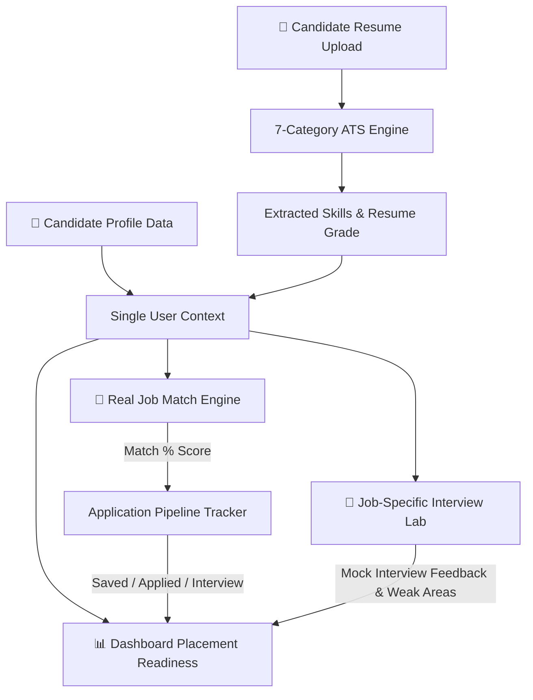
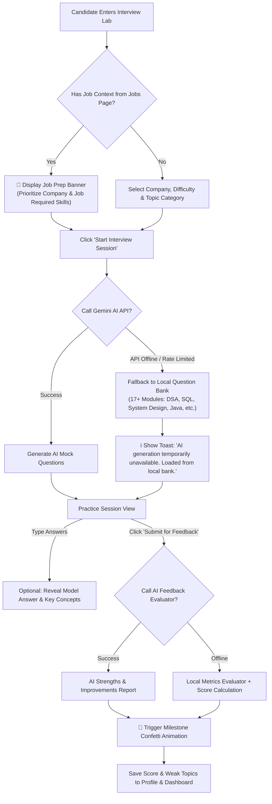

# Placement Cell AI Command Center — System Architecture & Flowcharts

This document details **how Job Discovery & Matching works** and **how the Technical Interview Lab operates**, including the AI resilience fallback architecture and full end-to-end candidate data flow.

---

## 1. End-to-End System Architecture Flowchart

The entire application operates on a **Single Candidate Context Flow**. Information flows seamlessly from the Resume & Profile into Job Matching, Interview Preparation, and the Placement Readiness Score on the Dashboard.



---

## 2. How Jobs Are Fetched & Matched (`Jobs.jsx`)

The Job Discovery module uses a **100% Deterministic Job Matching Algorithm** rather than random scraping. It compares candidate evidence directly against job scorecards.

```mermaid
flowchart TD
    SubGraph1[Job Data Source] -->|Fetch Active Jobs| J1[Jobs List API / Local Data]
    
    subgraph MatchEngine [Deterministic Job Match Engine - calculateJobMatch]
        J1 --> M1[1. Skill Match Calculation]
        J1 --> M2[2. Role & Title Alignment]
        J1 --> M3[3. Academic & Degree Eligibility]
        
        M1 -->|Weight: 50%| TOT[Total Match Percentage]
        M2 -->|Weight: 30%| TOT
        M3 -->|Weight: 20%| TOT
    end
    
    TOT -->|80% - 100%| P1["🟢 Strong Match Badge"]
    TOT -->|60% - 79%| P2["🟡 Moderate Match Badge"]
    TOT -->|< 60%| P3["🔴 Low Match Badge"]
    
    P1 --> MODAL[Job Detail Drawer]
    P2 --> MODAL
    P3 --> MODAL
    
    MODAL -->|Click "Prepare for Interview"| PREP["🎯 Navigate to /interview-questions\n(Passes Job Title, Company, Required Skills)"]
```

### Detailed Job Match Logic:
1. **Skill Match (50% Weight)**: Compares required job skills (e.g. `Java`, `SQL`, `React`) against candidate skills extracted from the resume and profile.
2. **Role Fit (30% Weight)**: Checks how closely the candidate's target role matches the posting's title (e.g. *Software Development Engineer* vs *Frontend Engineer*).
3. **Academic Fit (20% Weight)**: Verifies branch, graduation year, and degree requirements.
4. **Pipeline Tracking**: Candidates can move job cards across 5 pipeline stages: `Saved` → `Applied` → `Assessment` → `Interview` → `Selected`.

---

## 3. How Interview Preparation Works (`InterviewQuestions.jsx`)

The Interview Command Lab combines **Gemini AI Question Generation** with a **High-Availability Local Question Bank (17+ Topic Modules)** to guarantee 100% uptime even if offline or rate-limited.



### Key Technical Components:
1. **Context Pass-Through**: When clicking *"Prepare for Interview"* on any job card, `navigate('/interview-questions', { state: { jobTitle, company, requiredSkills } })` passes context directly to pre-configure the session.
2. **Question of the Day (`getQuestionOfTheDay`)**: Deterministically selects a daily technical challenge based on the current date, requiring zero API calls.
3. **Local Question Bank Architecture (`client/src/questions/*`)**:
   - `dsa.js`, `java.js`, `cpp.js`, `python.js`, `javascript.js`, `react.js`, `node.js`, `sql.js`, `os.js`, `cn.js`, `systemDesign.js`, `hr.js`, `behavioral.js`, `projects.js`.
4. **Resilience & Fallback**: If the backend AI service is unreachable, the system automatically falls back to local modular questions and generates structured feedback without crashing or showing error screens.
